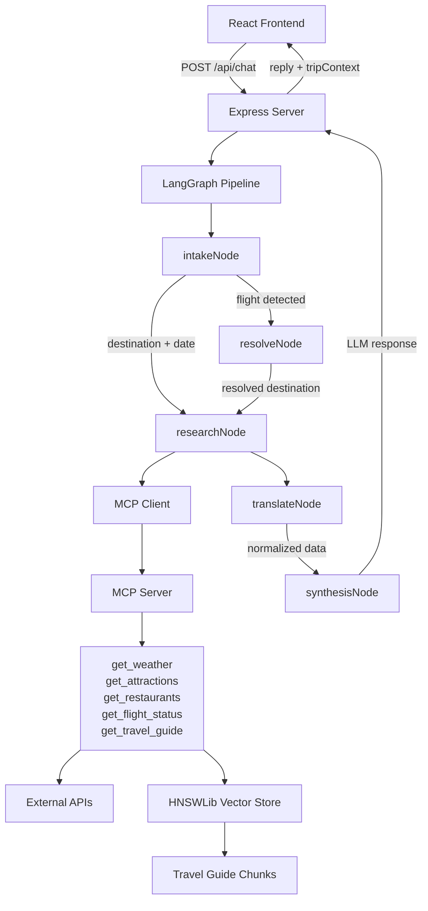

# TravelMate AI

TravelMate AI is a conversational travel planning chatbot that uses a multi-agent LangGraph pipeline, Model Context Protocol (MCP) tool integration, and Retrieval Augmented Generation (RAG) to provide real-time travel information and curated destination knowledge. Built as a capstone project for the **Code:You Artificial Intelligence Course - Jan 2026**, it demonstrates advanced LLM orchestration, tool integration, and full-stack AI development.

## Tech Stack

- **Frontend**: React (Vite) + Tailwind CSS
- **Backend**: Node.js + Express.js
- **AI Orchestration**: LangGraph + LangChain.js
- **LLM**: GPT-4o-mini via GitHub Models
- **Embeddings**: text-embedding-3-small via GitHub Models
- **Tool Transport**: Model Context Protocol (MCP) stdio transport
- **Vector Store**: HNSWLib (persistent, pure JavaScript)
- **APIs**: OpenWeatherMap, Foursquare Places, AeroDataBox via RapidAPI
- **Testing**: Jest (130 passing tests)

## Features

- **Real-time Weather Forecasts** – Current conditions and multi-day forecasts via OpenWeatherMap
- **Restaurant Recommendations** – Discover dining options via Foursquare Places API
- **Tourist Attraction Discovery** – Find attractions and points of interest via Foursquare Places API
- **Live Flight Status Lookup** – Track flights in real-time via AeroDataBox
- **RAG-Powered Travel Guides** – Curated destination knowledge covering visa requirements, cultural tips, seasonal advice, neighborhoods, transportation, packing, and general travel advice
- **Intent-Driven Tool Selection** – Only calls relevant APIs based on user intent, preventing unnecessary lookups
- **Multi-Turn Conversations** – Session memory powered by LangGraph MemorySaver for context-aware responses
- **Persistent Chat History** – Chat sessions stored in browser localStorage with create, switch, and delete functionality
- **Comprehensive Test Coverage** – 130 passing unit tests ensuring reliability

## Architecture Overview

### Frontend Layer

The frontend is a React + Vite + Tailwind CSS single-page application. The `useChat` hook manages incoming messages, loading state, and trip context (destination, date, flight information). The `useChatHistory` hook manages persistent chat sessions stored in browser localStorage, allowing users to create, switch between, and delete conversations. A `ChatHistoryPanel` component displays available sessions, while `TripContextBar` shows the current destination, travel date, and flight number above the chat window.

### Backend Layer

An Express.js server receives chat requests at the `/api/chat` endpoint and invokes the compiled LangGraph pipeline via `invokeGraph()`. The server also spawns an MCP server as a child process for tool access.

### LangGraph Pipeline

The `graph/` folder contains a modular pipeline of five sequential nodes:

1. **intakeNode** – Parses user messages using regex and chrono-node to extract destination, date, and flight number. Detects intent keywords (weather, restaurants, attractions, flight status, travel advice) to determine which tools to call.

2. **resolveNode** – If a flight number is detected, looks it up directly via `flightTool` to extract the destination airport, enabling destination-aware recommendations.

3. **researchNode** – Calls `ResearchAgent` which connects to the MCP server via stdio transport and dynamically selects which tools to invoke (get_weather, get_attractions, get_restaurants, get_travel_guide) based on detected intent.

4. **translateNode** – Calls `TranslateAgent` which uses the LLM to normalize raw API responses into clean structured JSON, ensuring consistent data formats downstream.

5. **synthesisNode** – Calls the LLM to combine normalized structured data into a single natural language response that directly answers the user's question.

Conditional routers between nodes direct the graph flow based on state — if a flight is detected, both resolve and research paths execute; if only a destination is mentioned, only research executes.

### MCP Server

The MCP server (`mcp-server/server.js`) exposes five tools via Model Context Protocol stdio transport:

- `get_weather(destination, date)` – Returns current weather and forecast
- `get_attractions(destination)` – Returns nearby attractions
- `get_restaurants(destination)` – Returns restaurant recommendations
- `get_flight_status(flightNumber)` – Returns flight details and status
- `get_travel_guide(destination)` – Returns curated travel advice from the RAG knowledge base

The server is spawned automatically as a child process by `MultiServerMCPClient` when the backend starts.

### RAG Knowledge Base

Eight travel guide markdown files (Tokyo, Barcelona, Paris, London, New York, Rome, San Diego, Bangkok) are chunked using `RecursiveCharacterTextSplitter` (500 character chunks with 100 character overlap) and embedded using `text-embedding-3-small`. The 156 resulting embeddings are stored in a persistent HNSWLib vector store that loads from disk in milliseconds. When a user asks practical travel advice questions, `get_travel_guide` performs semantic similarity search to retrieve relevant chunks.

## Architecture Diagram



## Project Structure

```
TravelMate-AI/
├── backend/
│   ├── graph/                  # Modular LangGraph nodes and routers
│   │   ├── nodes/              # intakeNode, resolveNode, researchNode,
│   │   │                        # translateNode, synthesisNode
│   │   ├── state.js            # GraphState and extractTripInfo utilities
│   │   ├── routers.js          # Conditional routing functions
│   │   ├── llm.js              # Shared LLM instance and retry logic
│   │   └── index.js            # compileGraph and invokeGraph functions
│   ├── agents/                 # Multi-agent implementations
│   │   ├── researchAgent.js    # Calls MCP tools based on intent
│   │   └── translateAgent.js   # Normalizes tool output to JSON
│   ├── tools/                  # Direct tool implementations
│   │   ├── weatherTool.js
│   │   ├── flightTool.js
│   │   ├── attractionsTool.js
│   │   ├── restaurantTool.js
│   │   ├── ragTool.js
│   │   ├── foursquareClient.js
│   │   └── index.js
│   ├── mcp-server/             # MCP stdio server exposing all tools
│   │   ├── server.js           # Entrypoint for MCP server
│   │   └── package.json
│   ├── knowledge-base/         # RAG travel guide markdown files
│   │   ├── Tokyo.md
│   │   ├── Barcelona.md
│   │   ├── Paris.md
│   │   ├── London.md
│   │   ├── New York.md
│   │   ├── Rome.md
│   │   ├── San Diego.md
│   │   └── Bangkok.md
│   ├── vector-store/           # Persistent HNSWLib embeddings
│   │   ├── hnswlib.index
│   │   ├── docstore.json
│   │   └── args.json
│   ├── scripts/                # One-time setup scripts
│   │   └── ingestDocs.js       # Embeds travel guides into vector store
│   ├── __tests__/              # Jest unit tests (130 tests)
│   │   ├── extractTripInfo.test.js
│   │   ├── intakeNode.test.js
│   │   ├── invokeGraph.test.js
│   │   ├── ragTool.test.js
│   │   ├── researchAgent.test.js
│   │   ├── sanity.test.js
│   │   ├── synthesisNode.test.js
│   │   └── translateAgent.test.js
│   ├── coverage/               # Jest coverage reports (auto-generated)
│   ├── prompts.js              # Centralized LLM prompts
│   ├── memory.js               # Memory utilities
│   ├── server.js               # Express entry point
│   ├── package.json
│   └── babel.config.js
└── frontend/
    ├── src/
    │   ├── components/         # React components
    │   │   ├── ChatWindow.jsx     # Main chat interface
    │   │   ├── ChatHistoryPanel.jsx
    │   │   ├── TripContextBar.jsx # Displays destination, date, flight
    │   │   ├── ChatTimeStamp.jsx
    │   │   └── TypingIndicator.jsx
    │   ├── hooks/              # Custom React hooks
    │   │   ├── useChat.js      # Message management and API calls
    │   │   └── useChatHistory.js  # localStorage persistence
    │   ├── App.jsx             # Main layout
    │   ├── main.jsx
    │   └── index.css
    ├── public/
    ├── package.json
    ├── vite.config.js
    ├── tailwind.config.cjs
    ├── postcss.config.cjs
    ├── eslint.config.js
    ├── index.html
    └── README.md
```

## Prerequisites

- **Node.js** v18 or higher
- **npm** v9 or higher
- A **GitHub account** with access to [GitHub Models](https://github.com/marketplace/models)
- API keys for:
  - **OpenWeatherMap** (free tier available at https://openweathermap.org/)
  - **Foursquare Places API** (free tier available at https://developer.foursquare.com/)
  - **AeroDataBox via RapidAPI** (free tier available at https://rapidapi.com/aedbx-aedbx/api/aerodatabox)

## Installation and Setup

### Step 1 — Clone the Repository

```bash
git clone <repository-url>
cd TravelMate-AI
```

### Step 2 — Install Backend Dependencies

```bash
cd backend
npm install
```

### Step 3 — Configure Environment Variables

Create a `backend/.env` file with the following variables:

```
GITHUB_TOKEN=your_github_models_token
GITHUB_MODELS_BASE_URL=https://models.github.ai/inference
OPENWEATHER_API_KEY=your_openweathermap_api_key
FOURSQUARE_API_KEY=your_foursquare_api_key
AERODATABOX_API_KEY=your_aerodatabox_rapidapi_key
PORT=3001
```

Obtain `GITHUB_TOKEN` from https://github.com/settings/tokens (no special permissions required for GitHub Models).

### Step 4 — Run the RAG Ingest Script (One Time Only)

```bash
cd backend
node scripts/ingestDocs.js
```

This embeds the eight travel guide markdown files into the persistent HNSWLib vector store. The script only needs to run once — the vector store persists between backend restarts.

### Step 5 — Install Frontend Dependencies

```bash
cd ../frontend
npm install
```

### Step 6 — Start the Backend

```bash
cd ../backend
node server.js
```

The backend will start on `http://localhost:3001` and spawn the MCP server as a child process.

### Step 7 — Start the Frontend (in a new terminal)

```bash
cd frontend
npm run dev
```

The frontend will start with Vite dev server.

### Step 8 — Open the Application

Navigate to `http://localhost:5173` in your browser.

## API Documentation

### POST /api/chat

Send a message to the chatbot and receive a contextualized response.

**Request Body:**

```json
{
  "sessionId": "string — unique session identifier",
  "message": "string — user message text"
}
```

**Response Body (Success):**

```json
{
  "reply": "string — AI generated response",
  "tripContext": {
    "destination": "string | null — parsed destination",
    "date": "string | null — YYYY-MM-DD format",
    "flightNumber": "string | null",
    "resolvedDestination": "string | null — destination from flight lookup",
    "flightStatus": "string | null — raw flight status if lookup succeeded",
    "intent": "string[] — detected intent keywords (weather, restaurants, etc.)",
    "toolsUsed": "string[] — MCP tools called for this message",
    "normalizedData": "object | null — structured travel data",
    "flightLookupFailed": "boolean",
    "lookupComplete": "boolean — true when graph finishes execution"
  }
}
```

**Response Body (Error):**

```json
{
  "error": true,
  "message": "string — error description"
}
```

## Usage Examples

### Example 1 — Weather Query

**User:** "What is the weather in Barcelona today?"

**Bot Response:** "In Barcelona today, expect partly cloudy skies with a high of 18°C and a low of 12°C. Tomorrow looks mostly clear with highs around 19°C. The five-day forecast shows stable conditions with temperatures ranging from 11–19°C, no rain expected."

_Triggered tools:_ `get_weather`

---

### Example 2 — Full Trip Planning

**User:** "I want to go to Tokyo on April 15th. What should I do there?"

**Bot Response:** "Tokyo on April 15th will have pleasant spring weather — highs around 22°C with moderate humidity. You'll find excellent restaurants like Nabezo and Ichiran Ramen, and don't miss attractions like Senso-ji Temple and Meiji Shrine. Pack layers and comfortable walking shoes. Visa requirements for US citizens include a valid passport (visit requirements depend on your nationality). Consider staying in Shibuya or Shinjuku for convenient access to trains and attractions."

_Triggered tools:_ `get_weather`, `get_restaurants`, `get_attractions`, `get_travel_guide`

---

### Example 3 — Travel Guide Query

**User:** "What should I know before visiting Paris?"

**Bot Response:** "Paris requires a valid passport for entry. The city operates on efficient public transportation — consider buying a Paris Visite pass. Culturally, dress modestly and learn basic French phrases; locals appreciate the effort. Best time to visit is April–May or September–October. Must-see neighborhoods include Le Marais (historic), Latin Quarter (bohemian), and Montmartre (artistic). Pack comfortable walking shoes and layers — winters are cold, summers warm but pleasant."

_Triggered tools:_ `get_travel_guide`

---

### Example 4 — Flight Status Query

**User:** "What is the status of flight AA123 departing today?"

**Bot Response:** "American Airlines flight AA123 is scheduled to depart at 2:45 PM and arrive at 5:30 PM. The flight is currently on schedule with no delays. Gate information will be posted 45 minutes before departure."

_Triggered tools:_ `get_flight_status`, `get_travel_guide` (if destination determined)

## Running Tests

### Run All Tests

```bash
cd backend
npm test
```

Runs all 130 unit tests across 8 test files with a summary of passes and failures.

### Run Tests with Coverage Report

```bash
npm test -- --coverage
```

Generates a detailed coverage report in `coverage/lcov-report/index.html`. Open it in a browser to see line-by-line coverage.

### Run a Specific Test File

```bash
npm test -- --testPathPattern=extractTripInfo
```

Runs only the `extractTripInfo.test.js` test file. Other available patterns: `intakeNode`, `invokeGraph`, `ragTool`, `researchAgent`, `sanity`, `synthesisNode`, `translateAgent`.

## Key Technical Decisions

### Why LangGraph Over a Simple Chain

LangGraph enables conditional routing between nodes based on state — essential for handling different conversation flows without massive if/else chains. A single message might trigger flight lookup → destination resolution → multi-tool research → data normalization → synthesis. LangGraph's explicit node-and-router pattern makes this flow clear and testable.

### Why Model Context Protocol for Tool Transport

Using MCP as the tool transport layer decouples tool implementations from agent logic. New tools can be added to the MCP server without modifying any agent code or LLM prompts. This follows the separation of concerns principle and makes the system easily extensible.

### Why Research → Translate → Synthesis Pipeline

Separating data gathering (ResearchAgent), normalization (TranslateAgent), and presentation (synthesisNode) follows the single responsibility principle. Each component has one job: research gathers raw data, translate converts it to consistent JSON, synthesis presents it naturally. This makes debugging easier and allows testing each step independently.

### Why HNSWLib Over Chroma or Pinecone

HNSWLib is pure JavaScript requiring no Python installation or separate server process. The vector store persists to disk via JSON serialization and loads in milliseconds on startup — ideal for a Node.js backend. Since there are only 156 embeddings, a lightweight in-process solution outperforms cloud-hosted alternatives for this project's scale.

### Why Intent Detection Before Tool Selection

Detecting what the user is asking about before calling any tools prevents unnecessary API calls and reduces latency. A user asking "What's the weather in Barcelona?" should not trigger Foursquare restaurant and attraction lookups. The intakeNode analyzes the message once, sets intent flags in the state, and each downstream tool only executes if its intent is present.

## License

MIT License

---

**Built with:** LangGraph, LangChain.js, React, Express.js, OpenAI Models, and MCP
